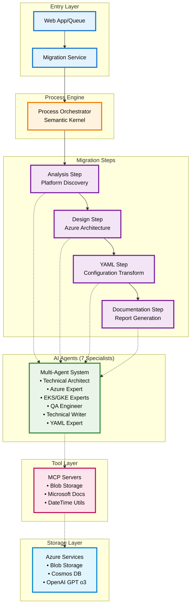
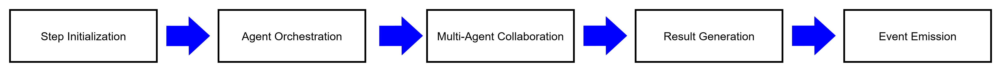

# Agentic Architecture - Container Migration Solution Accelerator

Based on your actual implementation, here's the comprehensive agentic architecture that mirrors the style of your reference image:

## Architecture Overview



## Agent Specialization by Phase

### Analysis Phase Agents

- **Technical Architect**: Leads overall analysis strategy and coordination
- **EKS Expert**: Identifies AWS EKS-specific patterns and configurations
- **GKE Expert**: Identifies Google GKE-specific patterns and configurations

### Design Phase Agents

- **Technical Architect**: Defines migration architecture patterns
- **Azure Expert**: Designs Azure service mappings and optimizations
- **EKS Expert**: Provides source platform context for AWS workloads
- **GKE Expert**: Provides source platform context for GCP workloads

### YAML Conversion Phase Agents

- **YAML Expert**: Performs configuration transformations and syntax optimization
- **Azure Expert**: Ensures Azure service integration and compliance
- **QA Engineer**: Validates converted configurations and tests
- **Technical Writer**: Documents conversion decisions and generates reports

### Documentation Phase Agents

- **Technical Architect**: Provides architectural documentation and migration summary
- **Azure Expert**: Documents Azure-specific configurations and optimizations
- **EKS/GKE Experts**: Document source platform analysis and transformation logic
- **QA Engineer**: Provides validation reports and testing documentation
- **Technical Writer**: Creates comprehensive migration documentation

## Data Flow Architecture

### Input Processing

1. **Queue Service** receives migration requests from web app or direct API
2. **Migration Service** processes queue messages and initiates migration process
3. **Process Orchestrator** manages step-by-step execution with event routing

### Step Execution Pattern

Each step follows this pattern:



### Storage Integration

- **Source Files**: Read from Azure Blob Storage via MCP Blob Operations
- **Working Files**: All processing files managed through Azure Blob Storage
- **Output Files**: Generated configurations and reports saved to Azure Blob Storage
- **Telemetry**: Agent interactions and process metrics stored in Azure Cosmos DB

### MCP Server Integration

All agents have access to Model Context Protocol (MCP) servers via Semantic Kernel plugin:

- **Blob Operations**: File reading/writing to Azure Blob Storage
- **Microsoft Docs**: Azure documentation lookup and best practices
- **DateTime Utilities**: Timestamp generation and time-based operations

## Key Architectural Principles

### Single Responsibility

Each step has a focused objective:

- Analysis: Platform detection and file discovery
- Design: Azure architecture and service mapping
- YAML: Configuration transformation and validation
- Documentation: Comprehensive report generation

### Event-Driven Orchestration

Steps communicate through Semantic Kernel events:

- `StartMigration` → Analysis Step
- `AnalysisCompleted` → Design Step
- `DesignCompleted` → YAML Step
- `YamlCompleted` → Documentation Step

### Multi-Agent Collaboration

Within each step, specialized agents collaborate through GroupChat orchestration:

- Structured conversation patterns
- Domain expertise contribution
- Consensus building on decisions
- Quality validation and review

### Tool-Enabled Intelligence

Agents access external capabilities through MCP servers:

- Cloud storage integration
- Documentation lookup
- Time-based operations

### Observability & Monitoring

Comprehensive tracking throughout the process:

- Agent interaction telemetry
- Process execution metrics
- Error handling and recovery
- Performance optimization data

## File Location Mapping

```text
src/
├── main_service.py                    # Queue Service Entry Point
├── services/migration_service.py      # Migration Orchestration
├── libs/processes/
│   └── aks_migration_process.py       # Process Framework Definition
├── libs/steps/
│   ├── analysis_step.py               # Analysis Step Implementation
│   ├── design_step.py                 # Design Step Implementation
│   ├── yaml_step.py                   # YAML Step Implementation
│   └── documentation_step.py          # Documentation Step Implementation
├── libs/steps/orchestration/
│   ├── analysis_orchestration.py      # Analysis Agent Orchestration
│   ├── design_orchestration.py        # Design Agent Orchestration
│   ├── yaml_orchestration.py          # YAML Agent Orchestration
│   └── documentation_orchestration.py # Documentation Agent Orchestration
├── agents/
│   ├── technical_architect/agent_info.py
│   ├── azure_expert/agent_info.py
│   ├── eks_expert/agent_info.py
│   ├── gke_expert/agent_info.py
│   ├── qa_engineer/agent_info.py
│   ├── technical_writer/agent_info.py
│   └── yaml_expert/agent_info.py
└── plugins/mcp_server/
    ├── MCPBlobIOPlugin.py             # Azure Blob Storage MCP Server
    ├── MCPMicrosoftDocs.py            # Microsoft Docs MCP Server
    └── MCPDatetimePlugin.py           # DateTime Utilities MCP Server
```

## Summary

This architecture implements a sophisticated agentic system that combines:

- **Semantic Kernel Process Framework** for structured workflow execution
- **Multi-Agent GroupChat Orchestration** for domain expertise collaboration
- **Model Context Protocol (MCP)** for tool integration and external system access
- **Azure Cloud Services** for scalable storage and data management
- **Event-Driven Architecture** for loose coupling and reliability

The result is a robust, scalable, and extensible migration solution that leverages the collective intelligence of specialized AI agents working in concert to solve complex container migration challenges.
