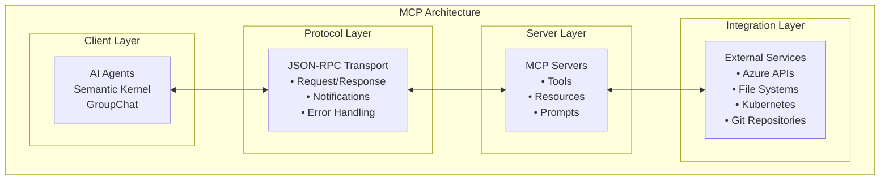
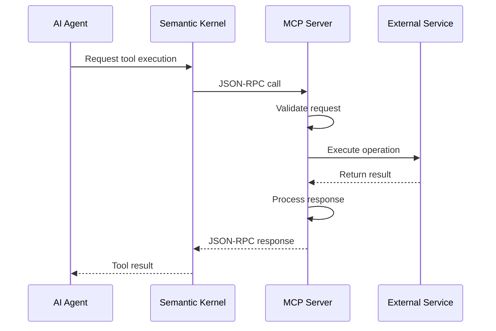

# MCP Server Implementation Guide

This guide provides comprehensive information for implementing, configuring, and extending Model Context Protocol (MCP) servers in the Container Migration Solution Accelerator.

## Overview

Model Context Protocol (MCP) servers provide a standardized way to extend AI agent capabilities with external tools, resources, and services. The Container Migration Solution Accelerator uses MCP to integrate with Azure services, file systems, Kubernetes clusters, and other external systems.

## MCP Architecture

### Core MCP Concepts



### MCP Protocol Elements

- **Tools**: Executable functions that agents can call
- **Resources**: Data sources and content that agents can access
- **Prompts**: Reusable prompt templates for agent interactions
- **Sampling**: Configuration for model behavior and parameters

### MCP Server Integration Flow



## Base MCP Server Implementation

### Abstract Base Server

```python
from abc import ABC, abstractmethod
from typing import Dict, Any, List, Optional
import json
import asyncio

class BaseMCPServer(ABC):
    """Abstract base class for MCP servers"""

    def __init__(self, server_name: str, config: Dict[str, Any]):
        self.server_name = server_name
        self.config = config
        self.tools = {}
        self.resources = {}
        self.prompts = {}
        self.is_initialized = False

    @abstractmethod
    async def initialize(self) -> bool:
        """Initialize the MCP server"""
        pass

    @abstractmethod
    async def cleanup(self) -> None:
        """Cleanup server resources"""
        pass

    # Tool Management
    async def list_tools(self) -> List[Dict[str, Any]]:
        """List available tools"""
        return [
            {
                "name": name,
                "description": tool.description,
                "inputSchema": tool.input_schema
            }
            for name, tool in self.tools.items()
        ]

    async def call_tool(self, name: str, arguments: Dict[str, Any]) -> Dict[str, Any]:
        """Call a specific tool"""
        if name not in self.tools:
            raise ValueError(f"Tool '{name}' not found")

        tool = self.tools[name]
        return await tool.execute(arguments)

    # Resource Management
    async def list_resources(self) -> List[Dict[str, Any]]:
        """List available resources"""
        return [
            {
                "uri": resource.uri,
                "name": resource.name,
                "description": resource.description,
                "mimeType": resource.mime_type
            }
            for resource in self.resources.values()
        ]

    async def read_resource(self, uri: str) -> Dict[str, Any]:
        """Read a specific resource"""
        if uri not in self.resources:
            raise ValueError(f"Resource '{uri}' not found")

        resource = self.resources[uri]
        return await resource.read()

    # Prompt Management
    async def list_prompts(self) -> List[Dict[str, Any]]:
        """List available prompts"""
        return [
            {
                "name": name,
                "description": prompt.description,
                "arguments": prompt.arguments
            }
            for name, prompt in self.prompts.items()
        ]

    async def get_prompt(self, name: str, arguments: Dict[str, Any] = None) -> Dict[str, Any]:
        """Get a specific prompt"""
        if name not in self.prompts:
            raise ValueError(f"Prompt '{name}' not found")

        prompt = self.prompts[name]
        return await prompt.render(arguments or {})
```

### Tool Implementation

```python
class MCPTool:
    """Represents an MCP tool"""

    def __init__(self, name: str, description: str, input_schema: Dict[str, Any],
                 executor: callable):
        self.name = name
        self.description = description
        self.input_schema = input_schema
        self.executor = executor

    async def execute(self, arguments: Dict[str, Any]) -> Dict[str, Any]:
        """Execute the tool with given arguments"""
        try:
            # Validate arguments against schema
            self._validate_arguments(arguments)

            # Execute tool function
            result = await self.executor(arguments)

            return {
                "content": [
                    {
                        "type": "text",
                        "text": str(result)
                    }
                ]
            }

        except Exception as e:
            return {
                "content": [
                    {
                        "type": "text",
                        "text": f"Error executing tool {self.name}: {str(e)}"
                    }
                ],
                "isError": True
            }

    def _validate_arguments(self, arguments: Dict[str, Any]):
        """Validate arguments against input schema"""
        # Implement JSON schema validation
        pass
```

### Resource Implementation

```python
class MCPResource:
    """Represents an MCP resource"""

    def __init__(self, uri: str, name: str, description: str,
                 mime_type: str, reader: callable):
        self.uri = uri
        self.name = name
        self.description = description
        self.mime_type = mime_type
        self.reader = reader

    async def read(self) -> Dict[str, Any]:
        """Read the resource content"""
        try:
            content = await self.reader()

            return {
                "contents": [
                    {
                        "uri": self.uri,
                        "mimeType": self.mime_type,
                        "text": content if isinstance(content, str) else json.dumps(content)
                    }
                ]
            }

        except Exception as e:
            raise RuntimeError(f"Failed to read resource {self.uri}: {str(e)}")
```

## Current MCP Server Implementation

The Container Migration Solution Accelerator includes the following MCP servers:

### MCPBlobIOPlugin.py
- **Purpose**: Azure Blob Storage operations
- **Capabilities**: Blob upload/download, container management, file operations
- **Usage**: Stores migration results, configuration backups, temporary files

### MCPMicrosoftDocs.py
- **Purpose**: Microsoft documentation integration
- **Capabilities**: Documentation search, content retrieval, reference lookup
- **Usage**: Access Azure documentation, best practices, configuration examples

### MCPDatetimePlugin.py
- **Purpose**: Date and time utilities
- **Capabilities**: Timestamp generation, date formatting, duration calculations
- **Usage**: Migration tracking, log timestamping, scheduling operations


## Best Practices

### 1. Server Design

- **Single Responsibility**: Each server should focus on a specific domain
- **Error Handling**: Comprehensive error handling with meaningful messages
- **Resource Management**: Proper cleanup of resources and connections
- **Security**: Implement appropriate authentication and authorization

### 2. Tool Design

- **Clear Documentation**: Provide clear descriptions and input schemas
- **Validation**: Validate all inputs before processing
- **Idempotency**: Design tools to be idempotent when possible
- **Performance**: Optimize for both speed and resource usage

### 3. Configuration

- **Environment-Specific**: Support different configurations for different environments
- **Secrets Management**: Use secure methods for storing sensitive configuration
- **Validation**: Validate configurations at startup
- **Documentation**: Document all configuration options

### 4. Monitoring

- **Performance Metrics**: Track tool performance and usage
- **Error Monitoring**: Monitor and alert on errors
- **Resource Usage**: Track memory and CPU usage
- **Audit Logging**: Log all tool calls for audit purposes

## Next Steps

1. **Understand MCP Concepts**: Learn the core MCP protocol and concepts
2. **Review Existing Servers**: Study the current MCP server implementations
3. **Identify Integration Needs**: Determine what external services need integration
4. **Implement Custom Servers**: Develop custom MCP servers for specific requirements
5. **Test and Monitor**: Implement comprehensive testing and monitoring

For additional information, refer to:

- [Configuring MCP Servers](ConfigureMCPServers.md)
- [Technical Architecture](TechnicalArchitecture.md)
- [Multi-Agent Orchestration Approach](MultiAgentOrchestration.md)
- [Deployment Guide](DeploymentGuide.md)
