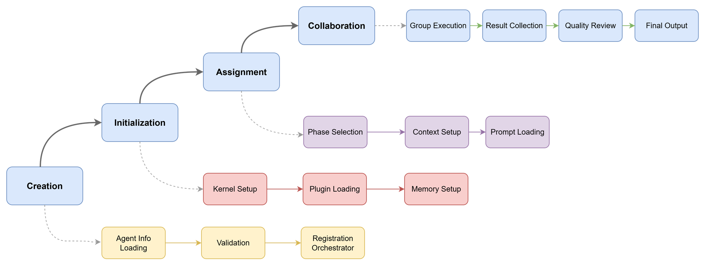

# Multi-Agent Orchestration Approach

This guide provides an in-depth look at the multi-agent orchestration system used by the Container Migration Solution Accelerator, including design principles, agent collaboration patterns, and implementation details.

## Overview

The Container Migration Solution Accelerator uses a sophisticated multi-agent orchestration approach built on Microsoft Semantic Kernel's GroupChatOrchestration functionality. This approach enables multiple specialized AI agents to collaborate effectively, bringing domain-specific expertise to different aspects of the migration process.

## Core Principles

### 1. Specialization and Expertise

Each agent is designed with a specific area of expertise:

- **Domain Focus**: Agents specialize in specific platforms, technologies, or aspects of migration
- **Deep Knowledge**: Each agent has comprehensive prompts and training for their domain
- **Collaborative Intelligence**: Agents work together to solve complex problems
- **Quality Assurance**: Built-in validation and review processes

### 2. Structured Collaboration

Agents collaborate through well-defined patterns:

- **Phase-Based Orchestration**: Agents participate in specific migration phases
- **Consensus Building**: Multiple agents contribute to decisions
- **Conflict Resolution**: Structured approaches to handle disagreements
- **Quality Gates**: Validation checkpoints throughout the process

### 3. Extensibility and Modularity

The system is designed for easy extension:

- **Plugin Architecture**: Easy addition of new agents and capabilities
- **Configurable Workflows**: Flexible orchestration patterns
- **Scalable Processing**: Efficient resource utilization
- **Platform Agnostic**: Support for multiple source and target platforms

## Agent Architecture

### Agent Specification

Each agent is defined by:

```python
class agent_info(BaseModel):
    agent_name: str                    # Agent identifier
    agent_type: AgentType             # Agent type (ChatCompletionAgent, AzureAIAgent, etc.)
    agent_system_prompt: str          # System prompt for the agent
    agent_instruction: str            # Specific agent instructions

    def render(self, **context) -> 'agent_info':
        """Render agent configuration with context variables"""
        template = Template(self.agent_system_prompt)
        rendered_prompt = template.render(**context)

        return agent_info(
            agent_name=self.agent_name,
            agent_type=self.agent_type,
            agent_system_prompt=rendered_prompt,
            agent_instruction=self.agent_instruction
        )
```
### Agent Lifecycle

Agents follow a structured lifecycle within the orchestration system:

1. **Creation**: Agents are instantiated with specific configurations and context
   - Agent Info Loading: Load agent-specific configuration and metadata
   - Validation: Validate agent configuration and requirements
   - Registration Orchestrator: Register agent with the orchestration manager

2. **Initialization**: Agents receive their system prompts and establish MCP connections
   - Kernel Setup: Initialize the Semantic Kernel environment
   - Plugin Loading: Load and configure MCP plugins and tools
   - Memory Setup: Establish agent memory and context management

3. **Assignment**: Agents are assigned to specific phases and receive contextual information
   - Phase Selection: Determine which migration phase the agent will participate in
   - Context Setup: Configure agent with phase-specific context and data
   - Prompt Loading: Load phase-specific system prompts and instructions

4. **Collaboration**: Agents participate in group chat orchestration and collaborative work
   - Group Execution: Active participation in multi-agent group chat sessions
   - Result Collection: Gather and consolidate outputs from collaborative sessions
   - Quality Review: Validate and review outputs for quality and completeness
   - Final Output: Generate final deliverables for the migration phase



The lifecycle ensures proper resource management and clear handoffs between different migration phases.
### Agent Types

#### 1. Strategic Agents

**Technical(Chief) Architect**
- **Role**: Overall migration strategy and architectural oversight
- **Responsibilities**:
  - Migration approach definition
  - Architecture pattern selection
  - Risk assessment and mitigation
  - Technology stack recommendations
  - Cross-functional coordination

**Azure Expert**
- **Role**: Azure platform expertise and optimization
- **Responsibilities**:
  - Azure service selection and configuration
  - Well-Architected Framework compliance
  - Cost optimization strategies
  - Security pattern implementation
  - Performance optimization

#### 2. Platform-Specific Agents

**EKS Expert**
- **Role**: Amazon EKS migration expertise
- **Responsibilities**:
  - EKS configuration analysis
  - AWS service mapping to Azure
  - Container registry migration (ECR to ACR)
  - Network configuration transformation
  - IAM to Azure AD mapping

**GKE Expert**
- **Role**: Google GKE migration expertise
- **Responsibilities**:
  - GKE workload analysis
  - Google Cloud service mapping
  - Container migration from GCR
  - Network policy transformation
  - Identity and access management

#### 3. Quality and Documentation Agents

**QA Engineer**
- **Role**: Quality assurance and validation
- **Responsibilities**:
  - Migration plan validation
  - Test strategy development
  - Quality gate definition
  - Risk identification
  - Compliance verification

**Technical Writer**
- **Role**: Documentation quality and structure
- **Responsibilities**:
  - Documentation organization
  - Technical writing standards
  - User guide creation
  - Process documentation
  - Knowledge base maintenance

#### 4. Specialized Technical Agents

**YAML Expert**
- **Role**: Configuration syntax and optimization
- **Responsibilities**:
  - YAML syntax validation and optimization
  - Configuration best practices
  - Resource optimization
  - Template standardization
  - Schema validation

## Orchestration Patterns

### 1. Step-Based Orchestration with MCP Context

Each migration step uses specialized orchestration with TaskGroup-safe MCP context management:

#### Analysis Step Orchestration

```python
class AnalysisOrchestrator(StepGroupChatOrchestrator):
    """Orchestrator specifically for Analysis step operations."""

    async def create_analysis_orchestration_with_context(
        self, mcp_context, process_context, agent_response_callback=None, telemetry=None
    ) -> GroupChatOrchestration:
        """Create analysis step orchestration with MCP context"""

        self.logger.info("[ART] Creating Analysis Step Group Chat Orchestration...")

        try:
            # Create analysis-specific agents
            orchestration = await self._create_analysis_agents(
                mcp_context=mcp_context,
                process_context=process_context,
                agent_response_callback=agent_response_callback,
                telemetry=telemetry,
            )
            return orchestration
        except Exception as e:
            self.logger.error(f"[FAILED] Failed to create analysis orchestration: {e}")
            raise RuntimeError(f"Analysis orchestration creation failed: {e}") from e

    async def _create_analysis_agents(
        self, mcp_context, process_context, agent_response_callback=None, telemetry=None
    ) -> GroupChatOrchestration:
        """Create agents specifically for Analysis phase"""

        agents = []

        # Technical Architect - Analysis lead
        agent_architect = await mcp_context.create_agent(
            agent_config=architect_agent(phase="analysis").render(**process_context),
            service_id="default",
        )
        agents.append(agent_architect)

        # Platform experts for source platform identification
        agent_eks = await mcp_context.create_agent(
            agent_config=eks_expert(phase="analysis").render(**process_context),
            service_id="default",
        )
        agents.append(agent_eks)

        agent_gke = await mcp_context.create_agent(
            agent_config=gke_expert(phase="analysis").render(**process_context),
            service_id="default",
        )
        agents.append(agent_gke)

        # Azure Expert for migration context
        agent_azure = await mcp_context.create_agent(
            agent_config=azure_expert(phase="analysis").render(**process_context),
            service_id="default",
        )
        agents.append(agent_azure)

        # Technical Writer for documentation
        agent_writer = await mcp_context.create_agent(
            agent_config=technical_writer(phase="analysis").render(**process_context),
            service_id="default",
        )
        agents.append(agent_writer)

        # Create analysis-specific orchestration
        orchestration = GroupChatOrchestration(
            members=agents,
            manager=AnalysisStepGroupChatManager(
                step_name="Analysis",
                step_objective="Analyze source Kubernetes configurations and identify migration requirements",
                service=self.kernel_agent.kernel.services["default"],
                max_rounds=50,
                process_context=process_context,
                telemetry=telemetry,
            ),
            agent_response_callback=agent_response_callback,
        )

        return orchestration
```

#### Design Step Orchestration

```python
class DesignOrchestrator(StepGroupChatOrchestrator):
    """Orchestrator specifically for Design step operations."""

    async def _create_design_agents(
        self, mcp_context, process_context, agent_response_callback=None, telemetry=None
    ) -> GroupChatOrchestration:
        """Create agents specifically for Design phase"""

        agents = []

        # Technical Architect - Design oversight
        agent_architect = await mcp_context.create_agent(
            agent_config=architect_agent(phase="design").render(**process_context),
            service_id="default",
        )
        agents.append(agent_architect)

        # Azure Expert - PRIMARY LEAD for Design phase
        agent_azure = await mcp_context.create_agent(
            agent_config=azure_expert(phase="design").render(**process_context),
            service_id="default",
        )
        agents.append(agent_azure)

        # Platform experts - Provide source platform context for design decisions
        agent_eks = await mcp_context.create_agent(
            agent_config=eks_expert(phase="design").render(**process_context),
            service_id="default",
        )
        agents.append(agent_eks)

        agent_gke = await mcp_context.create_agent(
            agent_config=gke_expert(phase="design").render(**process_context),
            service_id="default",
        )
        agents.append(agent_gke)

        # Notice: No QA Engineer or YAML Expert in Design phase
        # This shows how each phase can have its own focused agent team

        # Create design-specific orchestration
        orchestration = GroupChatOrchestration(
            members=agents,
            manager=DesignStepGroupChatManager(
                step_name="Design",
                step_objective="Design Azure architecture and service mappings for migration",
                service=self.kernel_agent.kernel.services["default"],
                max_rounds=100,  # Design needs more rounds for architecture decisions
                process_context=process_context,
                telemetry=telemetry,
            ),
            agent_response_callback=agent_response_callback,
        )

        return orchestration
```

#### YAML Step Orchestration

```python
class YamlOrchestrator(StepGroupChatOrchestrator):
    """Orchestrator specifically for YAML conversion step operations."""

    async def _create_yaml_agents(
        self, mcp_context, process_context, agent_response_callback=None, telemetry=None
    ) -> GroupChatOrchestration:
        """Create agents specifically for YAML conversion phase"""

        agents = []

        # YAML Expert - PRIMARY LEAD for YAML phase
        agent_yaml = await mcp_context.create_agent(
            agent_config=yaml_expert(phase="yaml").render(**process_context),
            service_id="default",
        )
        agents.append(agent_yaml)

        # QA Engineer - Quality validation
        agent_qa = await mcp_context.create_agent(
            agent_config=qa_engineer(phase="yaml").render(**process_context),
            service_id="default",
        )
        agents.append(agent_qa)

        # Azure Expert - Azure service configuration validation
        agent_azure = await mcp_context.create_agent(
            agent_config=azure_expert(phase="yaml").render(**process_context),
            service_id="default",
        )
        agents.append(agent_azure)

        # Technical Writer - Documentation of conversion decisions
        agent_writer = await mcp_context.create_agent(
            agent_config=technical_writer(phase="yaml").render(**process_context),
            service_id="default",
        )
        agents.append(agent_writer)

        # Create YAML-specific orchestration
        orchestration = GroupChatOrchestration(
            members=agents,
            manager=YamlStepGroupChatManager(
                step_name="YAML",
                step_objective="Convert and optimize Kubernetes YAML configurations for Azure",
                service=self.kernel_agent.kernel.services["default"],
                max_rounds=50,
                process_context=process_context,
                telemetry=telemetry,
            ),
            agent_response_callback=agent_response_callback,
        )

        return orchestration
```

### 2. MCP Context Management

The system uses TaskGroup-safe MCP context management to provide agents with access to external tools:

#### PluginContext Implementation

```python
class PluginContext:
    """
    Task-Group-Safe context manager for MCP plugins and Semantic Kernel plugins.

    This context manager uses TASK-GROUP-SAFE management for MCP plugins to completely
    avoid the "cancel scope in different task" errors caused by manual lifecycle
    management of anyio-based MCP plugins.
    """

    def __init__(
        self,
        kernel_agent: semantic_kernel_agent,
        plugins: list[MCPPluginBase | KernelPlugin | Any] | None = None,
        auto_add_to_kernel: bool = True,
    ):
        self.kernel_agent = kernel_agent
        self.kernel = kernel_agent.kernel
        self.plugins = plugins or []
        self.auto_add_to_kernel = auto_add_to_kernel

        # Task-Group-Safe resource management
        self._mcp_plugins: dict[str, MCPPluginBase] = {}
        self._kernel_plugins: dict[str, Any] = {}
        self._agents: list[Any] = []
        self._is_entered = False

    async def __aenter__(self):
        """Enter the context manager with TaskGroup scope management."""
        logger.info("Entering MCPContext with TaskGroup scope management")

        try:
            await self._setup_all_plugins()
            self._is_entered = True
            return self
        except Exception as e:
            logger.error(f"[FAILED] Failed to enter MCPContext: {e}")
            raise

    async def __aexit__(self, exc_type, exc_val, exc_tb):
        """Exit the context manager with proper cleanup."""
        logger.info("Exiting MCPContext with TaskGroup scope cleanup")

        # Clean up MCP plugins in reverse order
        for name, plugin in reversed(list(self._mcp_plugins.items())):
            try:
                await plugin.close()
                logger.info(f"[SUCCESS] MCP plugin '{name}' closed successfully")
            except Exception as e:
                logger.warning(f"[WARNING] Failed to close MCP plugin '{name}': {e}")

        self._is_entered = False
        logger.info("[SUCCESS] MCPContext cleanup completed")

    async def create_agent(
        self,
        agent_config: agent_info,
        service_id: str = "default",
    ) -> ChatCompletionAgent:
        """Create an agent within this context with MCP plugin access."""
        if not self._is_entered:
            raise RuntimeError("MCPContext must be entered before creating agents")

        logger.info(f"[ROBOT] Creating agent: {agent_config.agent_name}")

        # Collect all available plugins for the agent
        plugins_for_agent = []

        # Add connected MCP plugins
        for name, plugin in self._mcp_plugins.items():
            plugins_for_agent.append(plugin)
            logger.debug(f"[SUCCESS] Added connected MCP plugin to agent: {name}")

        # Create agent using AgentBuilder
        agent_builder = await AgentBuilder.create_agent(
            kernel_agent=self.kernel_agent,
            agent_info=agent_config,
            service_id=service_id,
            plugins=plugins_for_agent,
        )

        if agent_builder:
            self._agents.append(agent_builder)
            logger.info(f"[SUCCESS] Agent '{agent_config.agent_name}' created with MCP access")
            return agent_builder.agent
        else:
            raise RuntimeError(f"Failed to create agent: {agent_config.agent_name}")
```

#### MCP Plugin Setup

```python
async def _setup_mcp_plugin(self, plugin: MCPPluginBase, name: str) -> bool:
    """Setup an MCP plugin with TaskGroup scope management."""
    try:
        logger.info(f"Connecting to MCP server: {name}")

        # CRITICAL: Connect to the MCP server in same task context
        await plugin.connect()
        logger.info(f"[SUCCESS] MCP server connected successfully: {name}")

        # Store the connected plugin
        self._mcp_plugins[name] = plugin

        # Add to kernel if auto-add is enabled
        if self.auto_add_to_kernel:
            self.kernel.add_plugin(plugin=plugin, plugin_name=name)
            logger.debug(f"Connected MCP plugin '{name}' added to kernel")

        return True

    except Exception as e:
        logger.error(f"[FAILED] Failed to connect MCP plugin '{name}': {e}")
        return False
```

#### Usage Pattern

```python
# Step-level MCP context creation
def create_task_local_mcp_context(self) -> PluginContext:
    """Create task-local MCP context for TaskGroup-safe operations."""
    if self.kernel_agent is None:
        raise RuntimeError("Kernel agent not initialized")

    return PluginContext(
        kernel_agent=self.kernel_agent,
        plugins=[
            with_name(MCPDatetimePlugin.get_datetime_plugin(), "datetime"),
            with_name(MCPBlobIOPlugin.get_blob_file_operation_plugin(), "blob"),
            with_name(MCPMicrosoftDocs.get_microsoft_docs_plugin(), "msdocs"),
        ],
    )

# Step execution with MCP context
async def invoke(self, context: KernelProcessStepContext) -> None:
    """Execute step with TaskGroup-safe MCP context."""

    # Create task-local MCP context
    async with self.create_task_local_mcp_context() as mcp_context:

        # Create orchestration with MCP context
        orchestration = await self.orchestrator.create_orchestration_with_context(
            mcp_context=mcp_context,
            process_context=self.process_context,
            telemetry=self.telemetry_manager,
        )

        # Run orchestration
        result = await self.orchestrator.run_step_orchestration(
            orchestration=orchestration,
            task=self.build_step_prompt(),
            step_name="Analysis"
        )

        # Process results
        await self.process_step_results(result, context)
```

### 3. Step-Specific Group Chat Management

Each step uses specialized group chat managers that handle conversation flow, agent selection, and termination criteria:

#### Base Group Chat Manager

```python
class StepSpecificGroupChatManager(GroupChatManager):
    """
    Base group chat manager for step-specific orchestrations.

    Following best practices:
    - Focused on single step responsibility
    - Clear termination criteria per step
    - Appropriate agent selection for step context
    - Intelligent chat history management that preserves function calls
    - Agent response telemetry tracking
    """

    def __init__(
        self,
        step_name: str,
        step_objective: str,
        service: ChatCompletionClientBase,
        max_rounds: int = 50,
        process_context: dict[str, Any] = None,
        telemetry: TelemetryManager = None,
        **kwargs,
    ) -> None:
        self.step_name = step_name
        self.step_objective = step_objective
        self.process_context = process_context or {}
        self.telemetry = telemetry
        super().__init__(service, **kwargs)

    async def select_next_agent(
        self,
        chat_history: ChatHistory,
        participant_descriptions: dict[str, str],
    ) -> StringResult:
        """Select the next agent to speak based on step context."""

        # Track agent responses first
        await self._track_agent_message_if_new(chat_history)

        # Add step-specific selection prompt
        chat_history.messages.insert(
            0,
            ChatMessageContent(
                role=AuthorRole.SYSTEM,
                content=await self._render_prompt(
                    STEP_SELECTION_PROMPT,
                    step_name=self.step_name,
                    step_objective=self.step_objective,
                    participants="\n".join(
                        [f"{k}: {v}" for k, v in participant_descriptions.items()]
                    ),
                ),
            ),
        )

        # Smart truncation to manage context
        self._smart_truncate_chat_history(chat_history)

        # Get agent selection
        response = await get_chat_message_content_with_retry(
            self.service,
            chat_history,
            settings=PromptExecutionSettings(response_format=StringResult),
            config=get_orchestration_retry_config(),
            operation_name="select_next_agent",
        )

        # Parse and validate selection
        participant_selection = parse_agent_selection_safely(
            response.content,
            step_name=self.step_name,
            valid_agents=list(participant_descriptions.keys()),
        )

        selected_agent = participant_selection.result.strip()

        # Track selection in telemetry
        await self.telemetry.update_agent_activity(
            process_id=self.process_context.get("process_id"),
            agent_name=selected_agent,
            action="selected_for_turn",
            message_preview=f"Selected to speak next: {participant_selection.reason}",
        )

        return StringResult(
            result=selected_agent,
            reason=participant_selection.reason
        )

    def _smart_truncate_chat_history(
        self,
        chat_history: ChatHistory,
        max_messages: int = 20,
        preserve_system: bool = True,
        preserve_recent_functions: bool = True,
    ) -> None:
        """Intelligently truncate chat history while preserving important context."""

        if len(chat_history.messages) <= max_messages:
            return

        # Separate message types
        system_messages = []
        function_messages = []
        regular_messages = []

        for msg in chat_history.messages:
            if msg.role == AuthorRole.SYSTEM:
                system_messages.append(msg)
            elif hasattr(msg, "function_call") or msg.role == AuthorRole.TOOL:
                function_messages.append(msg)
            else:
                regular_messages.append(msg)

        # Calculate available space
        available_space = max_messages
        if preserve_system and system_messages:
            available_space -= 1  # Reserve space for latest system message

        # Preserve recent function call pairs (critical for migration workflow)
        preserved_functions = []
        if preserve_recent_functions and function_messages:
            preserved_functions = function_messages[-min(6, len(function_messages)):]
            available_space -= len(preserved_functions)

        # Take most recent regular messages
        preserved_regular = regular_messages[-available_space:] if available_space > 0 else []

        # Rebuild chat history
        new_messages = []

        if preserve_system and system_messages:
            new_messages.append(system_messages[-1])  # Latest system message

        new_messages.extend(preserved_regular)
        new_messages.extend(preserved_functions)

        # Replace chat history messages
        chat_history.messages.clear()
        chat_history.messages.extend(new_messages)

        logger.info(f"[MEMORY] Chat history truncated to {len(new_messages)} messages")

    async def _track_agent_message_if_new(self, chat_history: ChatHistory):
        """Track agent messages for telemetry and monitoring."""

        if not chat_history.messages or not self.telemetry:
            return

        recent_message = chat_history.messages[-1]

        # Extract agent name and message content
        if hasattr(recent_message, "name") and recent_message.name:
            agent_name = recent_message.name
        elif hasattr(recent_message, "metadata") and recent_message.metadata:
            agent_name = recent_message.metadata.get("agent_name", "Unknown")
        else:
            return  # Skip if we can't identify the agent

        # Get message content safely
        message_content = ""
        if hasattr(recent_message, "content") and recent_message.content:
            message_content = str(recent_message.content)

        if message_content:
            # Create message preview
            message_preview = (
                message_content[:150] + "..."
                if len(message_content) > 150
                else message_content
            )

            # Determine activity type based on content
            content_lower = message_content.lower()
            action_type = "responding"

            if any(word in content_lower for word in ["analyzing", "examining", "investigating"]):
                action_type = "analyzing"
            elif any(word in content_lower for word in ["designing", "planning", "creating"]):
                action_type = "designing"
            elif any(word in content_lower for word in ["found", "discovered", "detected"]):
                action_type = "reporting_findings"
            elif any(word in content_lower for word in ["let me", "i will", "i'll check"]):
                action_type = "thinking"
            elif any(word in content_lower for word in ["completed", "finished", "done"]):
                action_type = "completed"
            elif "function_call" in str(recent_message) or "tool" in content_lower:
                action_type = "using_tools"

            # Track agent activity
            await self.telemetry.update_agent_activity(
                process_id=self.process_context.get("process_id"),
                agent_name=agent_name,
                action=action_type,
                message_preview=message_preview,
            )

            logger.info(f"[TELEMETRY] {agent_name} -> {action_type}: {message_preview}")
```

#### Specialized Step Managers

```python
class AnalysisStepGroupChatManager(StepSpecificGroupChatManager):
    """Group chat manager specialized for Analysis Step."""

    async def should_terminate(self, chat_history: ChatHistory) -> Analysis_ExtendedBooleanResult:
        """Determine if analysis step is complete."""

        # Add termination analysis prompt
        chat_history.messages.insert(
            0,
            ChatMessageContent(
                role=AuthorRole.SYSTEM,
                content=await self._render_prompt(
                    ANALYSIS_TERMINATION_PROMPT,
                    step_name=self.step_name,
                    step_objective=self.step_objective,
                    source_file_folder=self.process_context.get("source_file_folder", ""),
                    output_file_folder=self.process_context.get("output_file_folder", ""),
                ),
            ),
        )

        # Get termination decision
        response = await get_chat_message_content_with_retry(
            self.service,
            chat_history,
            settings=PromptExecutionSettings(response_format=Analysis_ExtendedBooleanResult),
            config=get_orchestration_retry_config(),
            operation_name="should_terminate_analysis",
        )

        return response.content

class DesignStepGroupChatManager(StepSpecificGroupChatManager):
    """Group chat manager specialized for Design Step."""

    async def should_terminate(self, chat_history: ChatHistory) -> Design_ExtendedBooleanResult:
        """Determine if design step is complete."""

        # Add design-specific termination logic
        chat_history.messages.insert(
            0,
            ChatMessageContent(
                role=AuthorRole.SYSTEM,
                content=await self._render_prompt(
                    DESIGN_TERMINATION_PROMPT,
                    step_name=self.step_name,
                    step_objective=self.step_objective,
                    source_file_folder=self.process_context.get("source_file_folder", ""),
                    output_file_folder=self.process_context.get("output_file_folder", ""),
                ),
            ),
        )

        response = await get_chat_message_content_with_retry(
            self.service,
            chat_history,
            settings=PromptExecutionSettings(response_format=Design_ExtendedBooleanResult),
            config=get_orchestration_retry_config(),
            operation_name="should_terminate_design",
        )

        return response.content
```

### Agent Creation and Configuration

Agents are configured using phase-specific information:

```python
# Each agent has a get_agent_info function that returns phase-specific configuration
def get_agent_info(phase: MigrationPhase | str | None = None) -> agent_info:
    """Get agent configuration for specific migration phase"""

    if phase == "analysis":
        prompt_file = "./prompt-analysis.txt"
        instruction = "Focus on platform detection and source configuration analysis"
    elif phase == "design":
        prompt_file = "./prompt-design.txt"
        instruction = "Focus on Azure architecture design and service mapping"
    elif phase == "yaml":
        prompt_file = "./prompt-yaml.txt"
        instruction = "Focus on YAML conversion and configuration optimization"
    else:
        prompt_file = "./prompt-documentation.txt"
        instruction = "Focus on comprehensive documentation generation"

    return agent_info(
        agent_name="Azure_Expert",
        agent_type=AgentType.ChatCompletionAgent,
        agent_system_prompt=load_prompt_text(prompt_file),
        agent_instruction=instruction,
    )

# Agent template rendering with context
def render_agent_config(agent_config: agent_info, **context) -> agent_info:
    """Render agent configuration with context variables"""

    template = Template(agent_config.agent_system_prompt)
    rendered_prompt = template.render(**context)

    return agent_info(
        agent_name=agent_config.agent_name,
        agent_type=agent_config.agent_type,
        agent_system_prompt=rendered_prompt,
        agent_instruction=agent_config.agent_instruction,
    )
```

### Agent Types Implementation

#### Supported Agent Types

```python
class AgentType(str, Enum):
    AzureAssistantAgent = "AzureAssistantAgent"      # Azure Assistant API based agents
    AzureAIAgent = "AzureAIAgent"                    # Azure AI agent service
    ChatCompletionAgent = "ChatCompletionAgent"      # Standard chat completion agents
```

#### Agent Setup Logic

```python
async def _set_up_agent(
    self,
    agent_info: agent_info,
    service_id: str = "default",
    plugins: list[KernelPlugin | object | dict[str, Any]] | None = None,
    response_format: AgentsApiResponseFormatOption | None = None,
):
    """Set up agent based on agent_info.agent_type"""
    if plugins is None:
        plugins = []

    self.meta_data = agent_info

    match agent_info.agent_type:
        case AgentType.AzureAssistantAgent:
            await self._setup_azure_assistant_agent(agent_info, plugins)
        case AgentType.AzureAIAgent:
            await self._setup_azure_ai_agent(agent_info, plugins)
        case AgentType.ChatCompletionAgent:
            await self._setup_chat_completion_agent(
                agent_info=agent_info, service_id=service_id, plugins=plugins
            )
        case _:
            raise ValueError(f"Unsupported agent type: {agent_info.agent_type}")

async def _setup_chat_completion_agent(
    self,
    agent_info: agent_info,
    service_id: str = "default",
    plugins: list[KernelPlugin | object | dict[str, Any]] = None,
):
    """Setup Chat Completion Agent"""
    self.agent = self.kernel_agent.get_azure_ai_inference_chat_completion_agent(
        agent_name=agent_info.agent_name,
        agent_instructions=agent_info.agent_system_prompt,
        service_id=service_id,
        plugins=plugins,
    )
```

## Agent Telemetry and Monitoring

### TelemetryManager Implementation

The system includes comprehensive telemetry tracking for agent activities using the actual `TelemetryManager` class:

```python
# Actual TelemetryManager methods from your implementation
class TelemetryManager:
    """Clean telemetry manager for agent activity tracking."""

    async def init_process(self, process_id: str, phase: str, step: str):
        """Initialize telemetry for a new process."""

    async def update_agent_activity(
        self,
        process_id: str,
        agent_name: str,
        action: str,
        message_preview: str = "",
        tool_used: bool = False,
        tool_name: str = "",
        reset_for_new_step: bool = False,
    ):
        """Update agent activity."""

    async def track_tool_usage(
        self,
        process_id: str,
        agent_name: str,
        tool_name: str,
        tool_action: str,
        tool_details: str = "",
        tool_result_preview: str = "",
    ):
        """Track tool usage by agents."""

    async def render_agent_status(self, process_id: str) -> dict:
        """Enhanced agent status rendering with context-aware messages."""

    async def record_step_result(
        self, process_id: str, step_name: str, step_result: dict
    ):
        """Record the result of a completed step."""

    async def record_final_outcome(
        self, process_id: str, outcome_data: dict, success: bool = True
    ):
        """Record the final migration outcome with comprehensive results."""
```

### Agent Activity Tracking

```python
class AgentActivity(EntityBase):
    """Current activity status of an agent"""

    name: str
    current_action: str = "idle"
    last_message_preview: str = ""
    last_full_message: str = ""
    current_speaking_content: str = ""
    last_update_time: str = Field(default_factory=_get_utc_timestamp)
    is_active: bool = False
    is_currently_speaking: bool = False
    is_currently_thinking: bool = False
    thinking_about: str = ""
    current_reasoning: str = ""
    last_reasoning: str = ""
    reasoning_steps: list[str] = Field(default_factory=list)
    participation_status: str = "ready"
    last_activity_summary: str = ""
    message_word_count: int = 0
    activity_history: list[AgentActivityHistory] = Field(default_factory=list)
    step_reset_count: int = 0

class AgentActivityHistory(EntityBase):
    """Historical record of agent activity"""

    timestamp: str = Field(default_factory=_get_utc_timestamp)
    action: str
    message_preview: str = ""
    step: str = ""
    tool_used: str = ""
```

## Best Practices and Implementation Guidelines

### 1. Agent Design Principles

```python
agent_azure = await mcp_context.create_agent(
    agent_config=azure_expert(phase="yaml").render(**process_context),
    service_id="default",
)

# Agent configuration with phase-specific rendering
agent_config = get_agent_info(phase="analysis").render(**process_context)
```

### 2. Step-Specific Orchestration Patterns

```python
class StepGroupChatOrchestrator:
    async def run_step_orchestration(
        self, orchestration, task: str, step_name: str
    ) -> Any:
        """Execute step-specific orchestration with telemetry tracking."""
        return result
```

### 3. MCP Context Management

```python
async with asyncio.TaskGroup() as tg:
    # Create MCP context within task group
    mcp_context = tg.create_task(
        self._create_mcp_context_for_step(self.app_context)
    )

    # Use context for agent creation
    orchestration = await self.create_orchestration_with_context(
        await mcp_context,
        telemetry,
    )
```

### 4. Chat History Management
```python
def _smart_truncate_chat_history(
    self, chat_history: ChatHistory, max_tokens: int = 8000
) -> ChatHistory:
    """Intelligently truncate chat history while preserving context."""
    return truncated_history
```

This multi-agent orchestration approach provides a sophisticated, extensible foundation for complex container migration scenarios while maintaining clean separation of concerns and robust error handling.

## Summary

The Container Migration Solution Accelerator's multi-agent orchestration system demonstrates:

- **Specialized Agent Architecture**: Each agent brings domain-specific expertise to the migration process
- **Phase-Based Collaboration**: Structured workflows with clear handoffs between migration phases
- **Robust Resource Management**: TaskGroup-safe MCP context management and intelligent memory handling
- **Comprehensive Telemetry**: Complete tracking of agent activities and migration progress
- **Extensible Design**: Modular architecture supporting new platforms and agent types

This approach ensures reliable, scalable container migrations while maintaining high quality through collaborative AI expertise.
```
