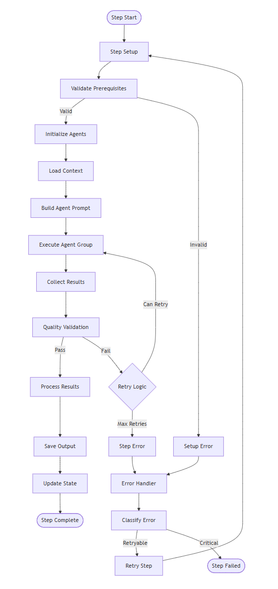

# Process Framework Implementation Guide

This guide provides detailed information about the process framework used in the Container Migration Solution Accelerator, including step definitions, execution patterns, and customization options.

## Overview

The Container Migration Solution Accelerator uses a step-based process framework that breaks down complex migration tasks into manageable, sequential phases. Each step is designed to be independent, testable, and extensible.

## Process Framework Architecture

### Core Components

The Process Framework consists of six core components organized in three functional layers:

#### Framework Components

| Component                | Purpose                                            | Layer           |
| ------------------------ | -------------------------------------------------- | --------------- |
| **Process Orchestrator** | Coordinates overall migration process execution    | Control Layer   |
| **Step Executor**        | Manages individual step execution and lifecycle    | Execution Layer |
| **Agent Orchestrator**   | Handles multi-agent collaboration and coordination | Execution Layer |
| **State Manager**        | Maintains process state and progress tracking      | Support Layer   |
| **Context Manager**      | Manages execution context and data flow            | Support Layer   |
| **Error Handler**        | Provides centralized error handling and recovery   | Support Layer   |

#### Component Interactions

The components interact through well-defined relationships:

**Primary Flow:**
- Process Orchestrator → Step Executor → Agent Orchestrator

**State Management:**
- Process Orchestrator → State Manager
- Agent Orchestrator → Context Manager

**Error Handling:**
- Step Executor → Error Handler
- State Manager → Error Handler
- Context Manager → Error Handler

### Step-Based Processing

The framework divides migration into four main steps:

1. **Analysis Step**: Platform detection and configuration analysis
2. **Design Step**: Azure architecture design and service mapping
3. **YAML Step**: Configuration transformation and Azure integration
4. **Documentation Step**: Comprehensive documentation generation

### Step Execution Flow


The step execution follows a sequential pattern with built-in error handling and state management:

1. **Process Initialization**: Context setup and validation
2. **Analysis Step**: Platform detection and configuration analysis
3. **Design Step**: Azure architecture design and service mapping
4. **YAML Step**: Configuration transformation and Azure integration
5. **Documentation Step**: Comprehensive documentation generation
6. **Process Completion**: Final validation and cleanup

Each step maintains its own state and can recover from errors independently, while the Process Orchestrator manages the overall flow and coordinates between steps.

## Step Implementation Pattern

### Base Step Structure

Each step follows the Semantic Kernel Process Framework pattern using `KernelProcessStep`:

```python
from semantic_kernel.processes.kernel_process import (
    KernelProcessStep,
    KernelProcessStepContext,
    KernelProcessStepState,
)
from pydantic import BaseModel, Field
from libs.steps.base_step_state import BaseStepState
from utils.tool_tracking import ToolTrackingMixin

class StepState(BaseStepState):
    """State for the step following SK Process Framework best practices."""

    # Base fields required by KernelProcessStepState
    name: str = Field(default="StepState", description="Name of the step state")
    version: str = Field(default="1.0", description="Version of the step state")

    # Step-specific state fields
    result: bool | None = None  # None = not started, True = success, False = failed
    reason: str = ""
    # Additional step-specific fields...

class Step(KernelProcessStep[StepState], ToolTrackingMixin):
    """
    Step implementation following SK Process Framework best practices.

    Features:
    - Single responsibility principle
    - Isolated kernel instance to prevent recursive invocation
    - Proper error handling and event emission
    - Pydantic-based parameter validation
    """

    state: StepState | None = Field(default_factory=lambda: StepState())

    async def activate(self, state: KernelProcessStepState[StepState]):
        """Activate the step for state initialization."""
        self.state = state.state
        self._ensure_state_initialized()

    def _ensure_state_initialized(self) -> None:
        """Ensure state is properly initialized before use."""
        if self.state is None:
            self.state = StepState(name="StepState", version="1.0")
```

### Parameter Validation Pattern

All steps implement Pydantic-based parameter validation:

```python
from pydantic import BaseModel, ValidationError

class StepParameter(BaseModel):
    """Pydantic model for step parameter validation"""
    model_config = {"arbitrary_types_allowed": True, "extra": "allow"}

    process_id: str
    source_file_folder: str
    workspace_file_folder: str
    output_file_folder: str
    container_name: str
    # Additional parameters...

def _create_parameters(self, context_data: dict[str, Any]) -> tuple[bool, StepParameter | None]:
    """
    Create and validate parameters using Pydantic model validation.

    Returns:
        tuple[bool, StepParameter | None]: (is_valid, validated_parameters)
    """
    try:
        # Use Pydantic's model_validate for comprehensive type checking
        validated_params = StepParameter.model_validate(context_data)
        return True, validated_params

    except ValidationError as e:
        # Enhanced error logging with detailed Pydantic validation errors
        error_details = []
        for error in e.errors():
            field = error.get("loc", ["unknown"])[0] if error.get("loc") else "unknown"
            message = error.get("msg", "Validation failed")
            error_details.append(f"{field}: {message}")

        logger.error(f"Parameter validation failed: {'; '.join(error_details)}")
        return False, None
```

## Step Implementations

### 1. Analysis Step

The analysis step detects platforms and analyzes configurations using real implementation:

```python
from libs.steps.analysis_step import AnalysisStep, AnalysisStepState
from libs.steps.orchestration.analysis_orchestration import AnalysisOrchestrator

class AnalysisStepState(BaseStepState):
    """State for the Analysis step following best practices."""

    name: str = Field(default="AnalysisStepState", description="Name of the step state")
    version: str = Field(default="1.0", description="Version of the step state")

    result: bool | None = None  # None = not started, True = success, False = failed
    reason: str = ""
    platform_detected: str = ""
    files_discovered: list = []
    analysis_completed: bool = False
    final_result: Analysis_ExtendedBooleanResult | None = None

class AnalysisStep(KernelProcessStep[AnalysisStepState], ToolTrackingMixin):
    """
    Analysis step that discovers YAML files and detects source platform.

    Following SK Process Framework best practices:
    - Single responsibility: file discovery and platform detection only
    - Isolated kernel instance to prevent recursive invocation
    - Proper error handling and event emission
    """

    @kernel_function(name="start_migration_analysis")
    async def start_migration_analysis(
        self, context: KernelProcessStepContext, context_data: dict[str, Any]
    ):
        """Execute analysis with comprehensive error handling and orchestration."""

        # Parameter validation using Pydantic
        is_valid, params = self._create_analysis_parameters(context_data)
        if not is_valid:
            await self._emit_analysis_failure(context, "Parameter validation failed")
            return

        try:
            # Initialize orchestrator with MCP plugins
            orchestrator = AnalysisOrchestrator(
                process_id=params.process_id,
                app_context=params.app_context,
                plugin_context=PluginContext()
            )

            # Execute analysis
            result = await orchestrator.execute_analysis(params)

            # Update state and emit success
            self.state.result = True
            self.state.platform_detected = result.platform_detected
            self.state.files_discovered = result.files_discovered
            self.state.analysis_completed = True

            await context.emit_event(
                KernelProcessEvent(id="analysis_completed", data=result.model_dump())
            )

        except Exception as e:
            # Comprehensive error handling
            await self._handle_analysis_error(context, e, params)
```

### 2. Design Step

The design step creates Azure architecture recommendations using the actual implementation:

```python
from libs.steps.design_step import DesignStep, DesignStepState
from libs.steps.orchestration.design_orchestration import DesignOrchestrator

class DesignStepState(BaseStepState):
    """State for the Design step following best practices."""

    name: str = Field(default="DesignStepState", description="Name of the step state")
    version: str = Field(default="1.0", description="Version of the step state")

    result: bool | None = None
    reason: str = ""
    architecture_created: str = ""
    design_recommendations: list[str] = Field(default_factory=list)
    azure_services: list[str] = Field(default_factory=list)
    migration_strategy: str = ""
    design_completed: bool = False

class DesignStep(KernelProcessStep[DesignStepState], ToolTrackingMixin):
    """
    Design step for creating Azure architecture and service mapping.

    Features:
    - Azure service recommendations
    - Architecture pattern suggestions
    - Cost estimation integration
    - Migration strategy planning
    """

    @kernel_function(name="start_migration_design")
    async def start_migration_design(
        self, context: KernelProcessStepContext, context_data: dict[str, Any]
    ):
        """Execute design phase with Azure service integration."""

        try:
            # Initialize design orchestrator with MCP plugins
            orchestrator = DesignOrchestrator(
                process_id=context_data["process_id"],
                app_context=context_data["app_context"],
                plugin_context=PluginContext()
            )

            # Execute design with multi-agent collaboration
            result = await orchestrator.execute_design(context_data)

            # Update state with design results
            self.state.result = True
            self.state.architecture_created = result.architecture
            self.state.azure_services = result.recommended_services
            self.state.migration_strategy = result.strategy
            self.state.design_completed = True

            await context.emit_event(
                KernelProcessEvent(id="design_completed", data=result.model_dump())
            )

        except Exception as e:
            await self._handle_design_error(context, e)
```

### 3. YAML Step

The YAML step transforms configurations to Azure-compatible formats using the real implementation:

```python
from libs.steps.yaml_step import YamlStep, YamlStepState
from libs.steps.orchestration.yaml_orchestration import YamlOrchestrator

class YamlStepState(BaseStepState):
    """State for the YAML step following best practices."""

    name: str = Field(default="YamlStepState", description="Name of the step state")
    version: str = Field(default="1.0", description="Version of the step state")

    result: bool | None = None
    reason: str = ""
    files_converted: list[str] = Field(default_factory=list)
    azure_integrations: list[str] = Field(default_factory=list)
    yaml_completed: bool = False

class YamlStep(KernelProcessStep[YamlStepState], ToolTrackingMixin):
    """
    YAML step for converting configurations to Azure-compatible formats.

    Features:
    - Kubernetes to AKS transformation
    - Azure service integration
    - Configuration validation
    - Multi-file processing
    """

    @kernel_function(name="start_migration_yaml")
    async def start_migration_yaml(
        self, context: KernelProcessStepContext, context_data: dict[str, Any]
    ):
        """Execute YAML transformation with Azure integration."""

        try:
            # Initialize YAML orchestrator with MCP plugins
            orchestrator = YamlOrchestrator(
                process_id=context_data["process_id"],
                app_context=context_data["app_context"],
                plugin_context=PluginContext()
            )

            # Execute YAML transformation
            result = await orchestrator.execute_yaml_conversion(context_data)

            # Update state with conversion results
            self.state.result = True
            self.state.files_converted = result.converted_files
            self.state.azure_integrations = result.azure_services_integrated
            self.state.yaml_completed = True

            await context.emit_event(
                KernelProcessEvent(id="yaml_completed", data=result.model_dump())
            )

        except Exception as e:
            await self._handle_yaml_error(context, e)
```

### 4. Documentation Step

The documentation step generates comprehensive migration documentation using the actual implementation:

```python
from libs.steps.documentation_step import DocumentationStep, DocumentationStepState
from libs.steps.orchestration.documentation_orchestration import DocumentationOrchestrator

class DocumentationStepState(BaseStepState):
    """State for the Documentation step following best practices."""

    name: str = Field(default="DocumentationStepState", description="Name of the step state")
    version: str = Field(default="1.0", description="Version of the step state")

    result: bool | None = None
    reason: str = ""
    documents_generated: list[str] = Field(default_factory=list)
    documentation_completed: bool = False

class DocumentationStep(KernelProcessStep[DocumentationStepState], ToolTrackingMixin):
    """
    Documentation step for generating comprehensive migration documentation.

    Features:
    - Migration analysis reports
    - Architecture documentation
    - Implementation guides
    - Troubleshooting documentation
    """

    @kernel_function(name="start_migration_documentation")
    async def start_migration_documentation(
        self, context: KernelProcessStepContext, context_data: dict[str, Any]
    ):
        """Execute documentation generation with comprehensive reporting."""

        try:
            # Initialize documentation orchestrator
            orchestrator = DocumentationOrchestrator(
                process_id=context_data["process_id"],
                app_context=context_data["app_context"],
                plugin_context=PluginContext()
            )

            # Execute documentation generation
            result = await orchestrator.execute_documentation(context_data)

            # Update state with documentation results
            self.state.result = True
            self.state.documents_generated = result.generated_documents
            self.state.documentation_completed = True

            await context.emit_event(
                KernelProcessEvent(id="documentation_completed", data=result.model_dump())
            )

        except Exception as e:
            await self._handle_documentation_error(context, e)
```

## Process Orchestration

### Main Process Implementation

The main migration process uses the Semantic Kernel Process Framework:

```python
from semantic_kernel.processes import ProcessBuilder
from libs.steps.analysis_step import AnalysisStep
from libs.steps.design_step import DesignStep
from libs.steps.yaml_step import YamlStep
from libs.steps.documentation_step import DocumentationStep

class AKSMigrationProcess:
    """
    Main migration process following SK Process Framework best practices.

    Process Flow:
    Analysis → Design → YAML Generation → Documentation

    Each step is isolated and communicates via events only.
    """

    @staticmethod
    def create_process():
        """
        Create the migration process with proper event routing.

        Following best practices:
        - Each step has single responsibility
        - Events handle all inter-step communication
        - Error handling at each step
        - Clear process boundaries
        """

        # Create ProcessBuilder with required parameters
        process_builder = ProcessBuilder(name="AKSMigrationProcess")

        # Add steps using default constructors
        analysis_step = process_builder.add_step(AnalysisStep)
        design_step = process_builder.add_step(DesignStep)
        yaml_step = process_builder.add_step(YamlStep)
        documentation_step = process_builder.add_step(DocumentationStep)

        # Configure event routing between steps
        process_builder.on_input_event("start_migration") \
            .send_event_to(analysis_step, "start_migration_analysis")

        analysis_step.on_event("analysis_completed") \
            .send_event_to(design_step, "start_migration_design")

        design_step.on_event("design_completed") \
            .send_event_to(yaml_step, "start_migration_yaml")

        yaml_step.on_event("yaml_completed") \
            .send_event_to(documentation_step, "start_migration_documentation")

        documentation_step.on_event("documentation_completed") \
            .stop_process()

        return process_builder.build()
```

### Migration Service Execution

The migration service coordinates process execution with comprehensive error handling:

```python
from services.migration_service import MigrationProcessor, MigrationEngineResult
from libs.processes.aks_migration_process import AKSMigrationProcess

class MigrationProcessor:
    """
    Migration processor with queue-based processing and timeout protection.

    Features:
    - Azure OpenAI integration
    - DefaultAzureCredential authentication
    - Comprehensive error classification
    - Telemetry and monitoring
    """

    async def process_migration_request(self, request_data: dict) -> MigrationEngineResult:
        """
        Process migration request using SK Process Framework.

        Returns:
            MigrationEngineResult with comprehensive execution metadata
        """
        process_id = request_data.get("process_id", str(uuid.uuid4()))
        start_time = time.time()

        try:
            # Create and start the migration process
            process = AKSMigrationProcess.create_process()

            # Execute with event-driven flow
            runtime = InProcessRuntime()
            process_handle = await runtime.start_process(process, request_data)

            # Wait for completion or timeout
            final_state = await self._wait_for_completion(process_handle)

            execution_time = time.time() - start_time

            return MigrationEngineResult(
                success=True,
                process_id=process_id,
                execution_time=execution_time,
                status=ProcessStatus.COMPLETED,
                final_state=final_state
            )

        except Exception as e:
            # Comprehensive error classification
            error_classification = classify_error(e)
            execution_time = time.time() - start_time

            return MigrationEngineResult(
                success=False,
                process_id=process_id,
                execution_time=execution_time,
                status=ProcessStatus.FAILED,
                error_message=str(e),
                error_classification=error_classification
            )
```

## Key Framework Features

### 1. MCP Plugin Integration

The framework integrates with Model Context Protocol (MCP) for Azure services:

```python
from plugins.mcp_server import MCPBlobIOPlugin, MCPDatetimePlugin, MCPMicrosoftDocs
from utils.mcp_context import PluginContext, with_name

class StepOrchestrator:
    """Base orchestrator with MCP plugin support"""

    def __init__(self, process_id: str, app_context: AppContext, plugin_context: PluginContext):
        self.process_id = process_id
        self.app_context = app_context
        self.plugin_context = plugin_context

        # Initialize MCP plugins for Azure integration
        self.blob_plugin = MCPBlobIOPlugin()
        self.docs_plugin = MCPMicrosoftDocs()
        self.datetime_plugin = MCPDatetimePlugin()
```

### 2. Tool Tracking and Telemetry

Steps include comprehensive tool tracking and telemetry:

```python
from utils.tool_tracking import ToolTrackingMixin
from utils.agent_telemetry import TelemetryManager

class Step(KernelProcessStep[StepState], ToolTrackingMixin):
    """Step with tool tracking capabilities"""

    def __init__(self):
        super().__init__()
        self.telemetry_manager = TelemetryManager()

    async def track_operation(self, operation_name: str, operation_data: dict):
        """Track operation with telemetry"""
        await self.telemetry_manager.record_operation(
            step_name=self.__class__.__name__,
            operation=operation_name,
            data=operation_data
        )
```

### 3. Error Classification and Recovery

Comprehensive error handling with classification:

```python
from utils.error_classifier import ErrorClassification, classify_error
from libs.models.failure_context import StepFailureState

async def _handle_step_error(self, context: KernelProcessStepContext, error: Exception):
    """Handle step errors with comprehensive classification"""

    # Classify error for handling strategy
    error_classification = classify_error(error)

    # Create rich failure context
    failure_context = StepFailureState(
        error_message=str(error),
        error_type=error_classification.error_type,
        severity=error_classification.severity,
        is_retryable=error_classification.is_retryable,
        step_name=self.__class__.__name__,
        timestamp=time.time()
    )

    # Update step state with failure context
    self.state.failure_context = failure_context
    self.state.result = False
    self.state.reason = str(error)

    # Emit failure event
    await context.emit_event(
        KernelProcessEvent(
            id="step_failed",
            data={
                "step_name": self.__class__.__name__,
                "error": str(error),
                "classification": error_classification.model_dump()
            }
        )
    )
```

## State Management

### Shared Process State

The framework uses a shared state model that flows between steps:

```python
from libs.processes.models.migration_state import MigrationProcessState

class MigrationProcessState(BaseModel):
    """
    Shared state that flows between all migration process steps.

    This represents the complete state of a migration process,
    designed to be passed as events between SK Process steps.
    """

    # Process Identity
    process_id: str
    user_request: str = ""

    # Step Control
    current_step: str = "initialization"

    # Shared Configuration
    source_platform: str = ""  # eks, gke, etc.
    target_platform: str = "azure"
    workspace_file_folder: str = "workspace"

    # Analysis Step Results
    platform_detected: str = ""
    files_discovered: list[str] = Field(default_factory=list)
    file_count: int = 0
    analysis_summary: str = ""
    analysis_completed: bool = False

    # Design Step Results
    architecture_created: str = ""
    design_recommendations: list[str] = Field(default_factory=list)
    azure_services: list[str] = Field(default_factory=list)
    migration_strategy: str = ""
    design_completed: bool = False

    # YAML Step Results
    files_converted: list[str] = Field(default_factory=list)
    azure_integrations: list[str] = Field(default_factory=list)
    yaml_completed: bool = False

    # Documentation Step Results
    documents_generated: list[str] = Field(default_factory=list)
    documentation_completed: bool = False
```

### Step-Specific State

Each step maintains its own isolated state that extends the base pattern:

```python
from libs.steps.base_step_state import BaseStepState
from libs.models.failure_context import StepFailureState

class BaseStepState(KernelProcessStepState):
    """Base state for all migration steps"""

    # Base fields required by KernelProcessStepState
    name: str = Field(default="BaseStepState", description="Name of the step state")
    version: str = Field(default="1.0", description="Version of the step state")

    # Rich failure context for error handling
    failure_context: StepFailureState | None = Field(
        default=None, description="Rich failure context when step fails"
    )

    # Comprehensive timing infrastructure
    execution_start_time: float | None = Field(default=None)
    execution_end_time: float | None = Field(default=None)
    orchestration_start_time: float | None = Field(default=None)
    orchestration_end_time: float | None = Field(default=None)
```

## Monitoring and Reporting

### Process Monitoring

The framework includes comprehensive monitoring and telemetry:

```python
from utils.agent_telemetry import TelemetryManager
from libs.reporting import MigrationReportGenerator, MigrationReportCollector

class ProcessMonitor:
    """Monitors process execution and collects telemetry"""

    def __init__(self):
        self.telemetry_manager = TelemetryManager()
        self.report_collector = MigrationReportCollector()

    async def monitor_step_execution(self, step_name: str, step_state: BaseStepState):
        """Monitor individual step execution"""

        # Record step metrics
        await self.telemetry_manager.record_step_metrics(
            step_name=step_name,
            execution_time=step_state.execution_end_time - step_state.execution_start_time,
            success=step_state.result,
            failure_context=step_state.failure_context
        )

        # Collect reporting data
        self.report_collector.add_step_result(step_name, step_state)
```

### Migration Reporting

Comprehensive reporting system for migration results:

```python
from libs.reporting.models.Processes import Process, Step
from libs.reporting import FailureType, FailureSeverity

class MigrationReportGenerator:
    """Generates comprehensive migration reports"""

    async def generate_migration_report(self, process_state: MigrationProcessState) -> dict:
        """Generate comprehensive migration report"""

        report = {
            "process_summary": {
                "process_id": process_state.process_id,
                "source_platform": process_state.source_platform,
                "target_platform": process_state.target_platform,
                "files_processed": process_state.file_count,
                "overall_status": self._determine_overall_status(process_state)
            },
            "step_results": {
                "analysis": {
                    "completed": process_state.analysis_completed,
                    "platform_detected": process_state.platform_detected,
                    "files_discovered": len(process_state.files_discovered)
                },
                "design": {
                    "completed": process_state.design_completed,
                    "azure_services": len(process_state.azure_services),
                    "architecture_created": bool(process_state.architecture_created)
                },
                "yaml": {
                    "completed": process_state.yaml_completed,
                    "files_converted": len(process_state.files_converted),
                    "azure_integrations": len(process_state.azure_integrations)
                },
                "documentation": {
                    "completed": process_state.documentation_completed,
                    "documents_generated": len(process_state.documents_generated)
                }
            }
        }

        return report
```

## Customization Guide

### Adding Custom Steps

To add a new processing step to the framework:

1. **Create Step State Class**: Inherit from `BaseStepState`
2. **Create Step Class**: Inherit from `KernelProcessStep` and `ToolTrackingMixin`
3. **Implement Kernel Functions**: Add `@kernel_function` decorated methods
4. **Add Error Handling**: Implement comprehensive error classification
5. **Register in Process**: Add to `AKSMigrationProcess`
6. **Create Orchestrator**: Implement step-specific orchestration if needed

### Example Custom Step

```python
from semantic_kernel.functions import kernel_function
from libs.steps.base_step_state import BaseStepState
from semantic_kernel.processes.kernel_process import (
    KernelProcessStep,
    KernelProcessStepContext,
    KernelProcessEvent
)

class CustomStepState(BaseStepState):
    """State for custom processing step"""

    name: str = Field(default="CustomStepState", description="Name of the step state")
    version: str = Field(default="1.0", description="Version of the step state")

    result: bool | None = None
    reason: str = ""
    custom_data: str = ""
    custom_completed: bool = False

class CustomStep(KernelProcessStep[CustomStepState], ToolTrackingMixin):
    """
    Custom step for specialized processing requirements.

    Following SK Process Framework best practices:
    - Single responsibility principle
    - Event-driven communication
    - Comprehensive error handling
    - Pydantic-based validation
    """

    state: CustomStepState | None = Field(
        default_factory=lambda: CustomStepState(name="CustomStepState", version="1.0")
    )

    async def activate(self, state: KernelProcessStepState[CustomStepState]):
        """Activate the step for state initialization."""
        self.state = state.state
        self._ensure_state_initialized()

    @kernel_function(name="start_custom_processing")
    async def start_custom_processing(
        self, context: KernelProcessStepContext, context_data: dict[str, Any]
    ):
        """Execute custom processing with error handling."""

        try:
            # Parameter validation
            is_valid, params = self._validate_parameters(context_data)
            if not is_valid:
                await self._emit_failure(context, "Parameter validation failed")
                return

            # Execute custom logic
            result = await self._perform_custom_processing(params)

            # Update state
            self.state.result = True
            self.state.custom_data = result
            self.state.custom_completed = True

            # Emit success event
            await context.emit_event(
                KernelProcessEvent(id="custom_completed", data={"result": result})
            )

        except Exception as e:
            await self._handle_custom_error(context, e)

    def _ensure_state_initialized(self) -> None:
        """Ensure state is properly initialized before use."""
        if self.state is None:
            self.state = CustomStepState(name="CustomStepState", version="1.0")
```

### Integration with Process

Add the custom step to the migration process:

```python
# In AKSMigrationProcess.create_process()
custom_step = process_builder.add_step(CustomStep)

# Configure event routing
yaml_step.on_event("yaml_completed") \
    .send_event_to(custom_step, "start_custom_processing")

custom_step.on_event("custom_completed") \
    .send_event_to(documentation_step, "start_migration_documentation")
```

## Next Steps

1. **Understand Step Pattern**: Learn the step implementation pattern
2. **Review Existing Steps**: Study the current step implementations
3. **Identify Custom Needs**: Determine if custom steps are needed
4. **Implement Extensions**: Add custom steps and orchestration patterns
5. **Monitor and Optimize**: Implement monitoring and optimize performance

For additional information, refer to:

- [Multi-Agent Orchestration Approach](MultiAgentOrchestration.md)
- [Technical Architecture](TechnicalArchitecture.md)
- [Adding Custom Expert Agents](CustomizeExpertAgents.md)
- [Configuring MCP Servers](ConfigureMCPServers.md)
