# Technical Architecture

This document provides a comprehensive technical overview of the Container Migration Solution Accelerator architecture, including system components, data flows, and integration patterns.

## Overview

The Container Migration Solution Accelerator is built on a modern, cloud-native architecture that leverages artificial intelligence, multi-agent orchestration, and the Model Context Protocol (MCP) to automate container platform migrations to Azure.

## High-Level Architecture

```mermaid
graph TB
    subgraph "User Interface Layer"
        UI[User Interface]
    end

    subgraph "Migration Orchestrator"
        MO[Migration Orchestrator<br/>• Process flow management<br/>• Step coordination<br/>• Agent orchestration]
    end

    subgraph "Process Steps"
        AS[Analysis Step<br/>• Platform detection<br/>• Source assessment]
        DS[Design Step<br/>• Azure architecture<br/>• Service mapping]
        YS[YAML Step<br/>• Configuration conversion<br/>• YAML validation]
        DOS[Documentation Step<br/>• Migration reports<br/>• User guides]
    end

    subgraph "Step-Specific Agent Groups"
        subgraph "Analysis Agents"
            TA1[Technical Architect]
            EKS1[EKS Expert]
            GKE1[GKE Expert]
        end

        subgraph "Design Agents"
            TA2[Technical Architect]
            AE1[Azure Expert]
            EKS2[EKS Expert]
            GKE2[GKE Expert]
        end

        subgraph "YAML Agents"
            AE2[Azure Expert]
            QA1[QA Engineer]
            TW1[Technical Writer]
            YE[YAML Expert]
        end

        subgraph "Documentation Agents"
            TA3[Technical Architect]
            AE3[Azure Expert]
            EKS3[EKS Expert]
            GKE3[GKE Expert]
            QA2[QA Engineer]
            TW2[Technical Writer]
        end
    end

    subgraph "Model Context Protocol (MCP)"
        BMC[Azure Blob Storage<br/>MCP Server]
        DMC[Microsoft Docs<br/>MCP Server]
        TMC[Datetime Utilities<br/>MCP Server]
    end

    subgraph "External Services"
        AZBS[Azure Blob Storage]
        MSDN[Microsoft Learn Docs]
        AI[AI Models<br/>GPT o3]
    end

    UI --> MO
    MO --> AS
    AS --> DS
    DS --> YS
    YS --> DOS

    AS --> TA1
    AS --> EKS1
    AS --> GKE1

    DS --> TA2
    DS --> AE1
    DS --> EKS2
    DS --> GKE2

    YS --> AE2
    YS --> QA1
    YS --> TW1
    YS --> YE

    DOS --> TA3
    DOS --> AE3
    DOS --> EKS3
    DOS --> GKE3
    DOS --> QA2
    DOS --> TW2

    TA1 --> BMC
    TA1 --> DMC
    TA1 --> TMC
    TA1 --> AI
    TA2 --> BMC
    TA2 --> DMC
    TA2 --> TMC
    TA2 --> AI
    TA3 --> BMC
    TA3 --> DMC
    TA3 --> TMC
    TA3 --> AI

    AE1 --> BMC
    AE1 --> DMC
    AE1 --> AI
    AE2 --> BMC
    AE2 --> DMC
    AE2 --> AI
    AE3 --> BMC
    AE3 --> DMC
    AE3 --> AI

    EKS1 --> BMC
    EKS1 --> AI
    EKS2 --> BMC
    EKS2 --> AI
    EKS3 --> BMC
    EKS3 --> AI

    GKE1 --> BMC
    GKE1 --> AI
    GKE2 --> BMC
    GKE2 --> AI
    GKE3 --> BMC
    GKE3 --> AI

    QA1 --> BMC
    QA1 --> AI
    QA2 --> BMC
    QA2 --> AI

    TW1 --> BMC
    TW1 --> DMC
    TW1 --> AI
    TW2 --> BMC
    TW2 --> DMC
    TW2 --> AI

    YE --> BMC
    YE --> AI

    BMC --> AZBS
    DMC --> MSDN
```


## Migration Workflow

The end-to-end migration process follows a structured workflow with clear phases and checkpoints:


## Implementation Architecture

The Container Migration Solution Accelerator follows a layered architecture that aligns with the actual codebase structure:

### Application Entry Points
- **main_service.py**: Service interface for hosted scenarios

### Service Layer
- **migration_service.py**: Core MigrationProcessor with queue-based processing
- **queue_service.py**: Azure Storage Queue integration
- **retry_manager.py**: Retry logic and error recovery

### Process Framework (Semantic Kernel)
- **aks_migration_process.py**: Main process definition using ProcessBuilder
- **Step-based execution**: Analysis → Design → YAML → Documentation

### Agent Implementation
- **Individual agent directories**: Each expert agent has dedicated folder with prompts
- **Semantic Kernel GroupChat**: Multi-agent orchestration
- **Azure OpenAI integration**: GPT o3 model support

### MCP Server Integration
- **Plugin-based architecture**: Modular MCP server implementations
- **Azure service integration**: Blob storage, documentation APIs
- **File operations**: Local and cloud file management

### Implementation Component Map

```mermaid
flowchart LR
    subgraph UI["🎯 Entry Points"]
        direction TB
        MAIN[main.py<br/>CLI Interface]
        SERVICE[main_service.py<br/>Service Interface]
    end

    subgraph CORE["🔄 Process Engine"]
        direction TB
        MIGRATION[MigrationProcessor<br/>Core Engine]
        PROCESS[AKSMigrationProcess<br/>Workflow Definition]
        MIGRATION --- PROCESS
    end

    subgraph STEPS["📋 Migration Steps"]
        direction LR
        ANALYSIS[Analysis<br/>Platform Discovery]
        DESIGN[Design<br/>Architecture Planning]
        YAML[YAML<br/>Configuration Transform]
        DOCS[Documentation<br/>Guide Generation]
        ANALYSIS --> DESIGN
        DESIGN --> YAML
        YAML --> DOCS
    end

    subgraph AI["🤖 AI Layer"]
        direction TB
        AGENTS[Multi-Agent System<br/>7 Specialized Agents<br/>Semantic Kernel GroupChat]
    end

    subgraph TOOLS["🔌 Tool Integration"]
        direction TB
        MCP[3 MCP Servers<br/>• Blob Storage<br/>• Microsoft Docs<br/>• DateTime Utilities]
    end

    subgraph CLOUD["☁️ External Services"]
        direction TB
        AZURE[Azure Services<br/>• OpenAI GPT o3<br/>• Blob Storage<br/>• Documentation APIs]
    end

    %% Main flow connections
    UI --> CORE
    CORE --> STEPS

    %% AI integration (dotted for supporting role)
    STEPS -.-> AI
    AI --> TOOLS
    TOOLS --> CLOUD

    %% Responsive styling with better contrast
    classDef entryPoint fill:#e3f2fd,stroke:#1976d2,stroke-width:2px,color:#000
    classDef processCore fill:#fff3e0,stroke:#f57c00,stroke-width:2px,color:#000
    classDef migrationStep fill:#f3e5f5,stroke:#7b1fa2,stroke-width:2px,color:#000
    classDef aiLayer fill:#e8f5e8,stroke:#388e3c,stroke-width:2px,color:#000
    classDef toolLayer fill:#fce4ec,stroke:#c2185b,stroke-width:2px,color:#000
    classDef cloudLayer fill:#e1f5fe,stroke:#0288d1,stroke-width:2px,color:#000

    class UI,MAIN,SERVICE entryPoint
    class CORE,MIGRATION,PROCESS processCore
    class STEPS,ANALYSIS,DESIGN,YAML,DOCS migrationStep
    class AI,AGENTS aiLayer
    class TOOLS,MCP toolLayer
    class CLOUD,AZURE cloudLayer
```


### Data Flow Architecture

## Core Components

### 1. Migration Orchestrator

The central orchestration engine that manages the entire migration workflow.

**Responsibilities:**
- Process flow management
- Step coordination and sequencing
- Error handling and recovery
- Progress tracking and reporting
- Resource management

**Key Classes:**
- `MigrationOrchestrator`: Main orchestration controller
- `StepExecutor`: Individual step execution management
- `ProcessState`: Migration state management
- `ErrorHandler`: Error handling and recovery

**Implementation Location:**
```text
src/libs/processes/
├── migration_orchestrator.py    # Main orchestrator
├── step_executor.py            # Step execution logic
├── process_state.py            # State management
└── error_handler.py            # Error handling
```

### 2. Step-Based Processing Architecture

The migration process is divided into discrete, sequential steps:

#### Analysis Step
- **Purpose**: Source platform analysis and configuration discovery
- **Input**: Source configuration files and platform information
- **Output**: Analysis report with platform-specific insights
- **Implementation**: `src/libs/steps/analysis_step.py`

#### Design Step
- **Purpose**: Azure architecture design and service mapping
- **Input**: Analysis results and source configurations
- **Output**: Azure architecture recommendations and design patterns
- **Implementation**: `src/libs/steps/design_step.py`

#### YAML Conversion Step
- **Purpose**: Configuration transformation to Azure-compatible YAML
- **Input**: Source configurations and design recommendations
- **Output**: Azure Kubernetes Service (AKS) compatible YAML files
- **Implementation**: `src/libs/steps/yaml_step.py`

#### Documentation Step
- **Purpose**: Migration documentation and implementation guides
- **Input**: All previous step outputs and transformation decisions
- **Output**: Comprehensive migration documentation
- **Implementation**: `src/libs/steps/documentation_step.py`

### 3. Multi-Agent System

Built on Microsoft Semantic Kernel with GroupChat orchestration:

#### Technical Architect Agent
- **Role**: Overall migration strategy and architectural decisions
- **Expertise**: Cloud architecture patterns, migration best practices
- **Phase Participation**: All phases with strategic oversight

#### Azure Expert Agent
- **Role**: Azure-specific optimizations and Well-Architected Framework compliance
- **Expertise**: Azure services, cost optimization, security patterns
- **Phase Participation**: Design, YAML conversion, documentation

#### Platform Expert Agents
- **Role**: Source platform-specific knowledge and transformation patterns
- **Variants**: EKS Expert, GKE Expert (extensible for future platforms)
- **Expertise**: Platform-specific configurations, migration patterns
- **Phase Participation**: Analysis, design, YAML conversion

#### QA Engineer Agent
- **Role**: Quality assurance, validation, and testing strategies
- **Expertise**: Testing patterns, validation criteria, quality gates
- **Phase Participation**: All phases with validation focus

#### Specialized Agents
- **YAML Expert**: Configuration syntax and optimization
- **Technical Writer**: Documentation quality and structure

### 4. Model Context Protocol (MCP) Integration

MCP provides standardized access to external tools and services:

#### Azure Blob Storage MCP Server
- **Purpose**: Azure Blob Storage operations and file management
- **Capabilities**: Blob operations, container management, file storage
- **Implementation**: `MCPBlobIOPlugin.py`

#### File Operations MCP Server
- **Purpose**: Local file system operations and document management
- **Capabilities**: File I/O, YAML/JSON processing, file validation
- **Implementation**: `MCPFileIOPlugin.py`

#### Microsoft Docs MCP Server
- **Purpose**: Microsoft documentation API integration
- **Capabilities**: Documentation retrieval, content processing, reference lookup
- **Implementation**: `MCPMicrosoftDocs.py`

#### Datetime Utilities MCP Server
- **Purpose**: Date and time operations for migration tracking
- **Capabilities**: Timestamp generation, date formatting, scheduling
- **Implementation**: `MCPDatetimePlugin.py`

## Technology Stack

### Core Framework
- **Microsoft Semantic Kernel**: AI orchestration and agent management
- **Python 3.12+**: Primary programming language
- **asyncio**: Asynchronous processing and concurrency
- **Pydantic**: Data validation and serialization

### AI and ML
- **GPT o3**: Primary language model for agent reasoning
- **Azure OpenAI**: AI service integration
- **Model Context Protocol (MCP)**: Tool and resource integration

### Configuration and Data
- **YAML/JSON**: Configuration file processing
- **Jinja2**: Template processing and generation
- **ruamel.yaml**: Advanced YAML processing with preservation

### Azure Integration
- **Azure SDK for Python**: Azure service integration
- **Azure Identity**: Authentication and authorization
- **Azure Kubernetes Service**: Target platform APIs
- **Azure Container Registry**: Container image management

### Development and Operations
- **uv**: Package management and virtual environments
- **pytest**: Testing framework
- **Docker**: Containerization for deployment
- **Git**: Version control and repository management

For additional technical details, refer to:

- [Multi-Agent Orchestration Approach](MultiAgentOrchestration.md)
- [Process Framework Implementation](ProcessFrameworkGuide.md)
- [MCP Server Implementation Guide](MCPServerGuide.md)
- [Deployment Guide](DeploymentGuide.md)
